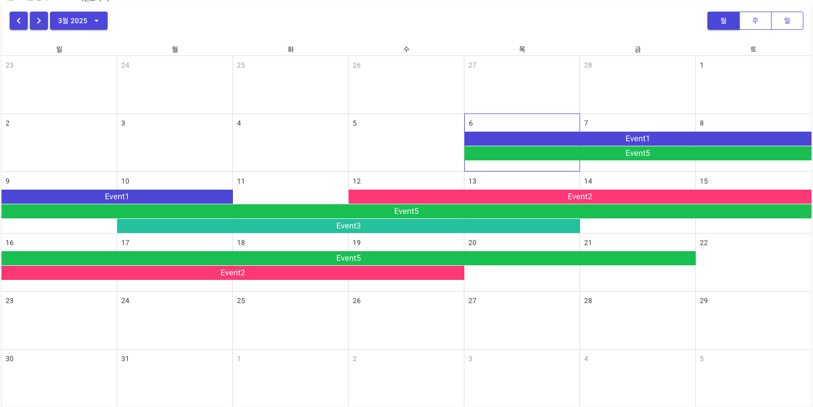

# manage_tool

### How to Use

``` shell
# use this script in main project
dotnet tool install --global dotnet-ef
dotnet ef database update     
```

### Development Stck
- Blazor Server
- EF Core
- .NET 8
- MudBlazor
- Heron.MudCalendar

### ScreenShot




